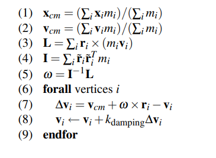

# Amittai

## COSC 89.18 Final Project: Position Based Dynamics

For my final project, I implemented the position-based dynamics simulator discussed by Muller et al. in their paper ["Position-Based Dynamics for Rigid Bodies"](https://matthias-research.github.io/pages/publications/posBasedDyn.pdf).

In the paper, the researchers describe a method for simulating the dynamics of particle-based objects using positions and constraints instead of the mass-spring model.

An advantage of this position-based model is better controllability &mdash; insdeed, while the mass-spring model we implemented in A1 earlier in the term required significant parameter tuning, the position-based model worked almost out-of-the-box.

### Model Discussion

#### 1. Mathematical Model

We represent a dynamic object by a set of $N$ vertices and $M$
constraints.

A vertex $i \in [1,...,N]$ has a mass $m_{i}$. a position $x_{i}$ and a velocity $v_{i}$.

A constraint $j \in j [1,...,M]$ consists of:

- a cardinality $n_{j}$
- a function $C_{j} : \mathbb{R}_{3_{nj}} \to \mathbb{R}$
- a set of indices $\{i_{1},\dots i_{nj}$, $i_{k} \in [1,...N]$
- a stiffness parameter $k_{j} \in [0...1]$
- a **type** of either **equality** or **inequality**

Constraint $j$ with type **equality** is satisfied if
$C_{j}(x_{i_{1}},\dots,x_{i_{n_{j}}}) = 0$.

Constraint $j$ with type **inequality** is satisfied if
$C_{j}(x_{i_{1}},\dots,x_{i_{n_{j}}}) \ge 0$.

The stiffness parameter $k_{j}$ defines the strength of the constraint $j$ in a range from zero to one.

#### 2. Numerical Algorithm

Based on the above model, at timestep $\Delta t$, the dynamic object is simulated as follows:

```{math}
  forall vertices i
    initialize xi, vi, wi
  endfor
  loop
    forall vertices i do update vi with external Forces
    dampVelocities(v1,...,vN)
    forall vertices i do pi = xi +timestep * vi
    forall vertices i do 
      generateCollisionConstraints(xi to pi)
    loop solverIterations times
      projectConstraints(C1,...,CM+Mcoll ,p1,...,pN)
    endloop
    forall vertices i
      vi = (pi - xi) / timestep
      xi = pi
    endfor
    velocityUpdate(v1,...,vN)
  endloop
```

\pagebreak

#### 3. Code Implementation

- **Main simulation loop:**

```cpp
    void AdvancePBD(double dt) {
      ApplyForce(dt);
      DampVelocities();
      Project(next_positions, dt);
      auto collision_constraints = GenerateCollisionConstraints();
      ProjectCollisionConstraints2(collision_constraints, next_positions, dt);
      ProjectDistanceConstraints(next_positions, dt);
      EnforceBoundaryConditions();
      UpdateParticles(next_positions, dt);
      ResetForces();
    }
```

- **Constraints:**

My simulation represents constraints as two arrays, the first containing an `std::pair<int, int>` of the two indices in the constraint, and the second containing an `double` representing the weight of the constraint.

A shortfall with this representation is that the constraint is not able to have a cardinality greater than 2.

- **Solver:**
  
As discussed in the paper, I implemented these formulae for constraint projection:

$$
\Delta p_{1} = - \frac{w_{1}}{w_{1} + w_{2}} (|p_{1}-p_{2}|-d)\frac{p_{1}-p_{2}}{|p_{1}-p_{2}|}
$$
$$
\Delta p_{2} = + \frac{w_{2}}{w_{1} + w_{2}} (|p_{1}-p_{2}|-d)\frac{p_{1}-p_{2}}{|p_{1}-p_{2}|}
$$

- **Damping:**

As discussed in the paper, I implemented my damping function as follows:



\pagebreak

#### 4. Examples

Since my project was based on the priorly done assignment 1, A sanity check was to certify correct behavior on the A1 tests.

You can control which scenario runs;

```text
  1 = single strand / pendulum, demonstrate correct dynamics.
  2 = multiple strands with collisions, demonstrate correct collision handling.
  3 = 2D cloth, demonstrate correct dynamics.
  4 = 3D beam, demonstrate correct dynamics.
  5 = 3D curly hair strand
  6 = An array of falling particles bouncing off a surface.
  7 = Particle-Sand set-up with Position-based Dynamics.
```

## How To Run

I implemented my project on top of A1, so it should be runnable by running `a1_mass_spring` through

```bash
  scripts/run_assignment.sh a1_mass_spring [1-7]
```

Or, if on windows:

```powershell
  scripts\run_assignment.bat a1_mass_spring [1-7]
```

I also changed some of the provided source-code (`ImplicitDriver`, `Common.h`, `Particles.h`). To avoid conflicts, I added them in the `a1_mass_spring/src` directory and changed the `#include` statements to try to pick up those specific versions over the global versions.
